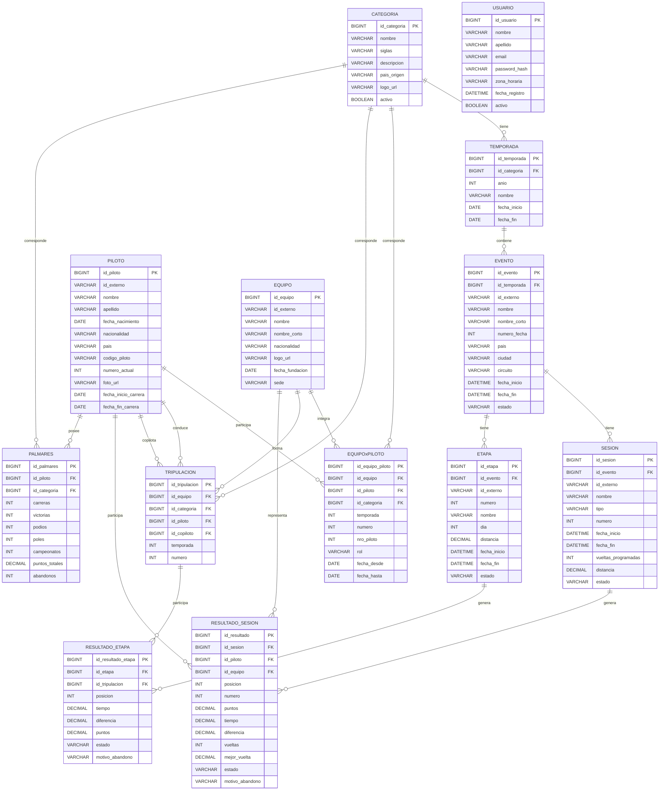

```mermaid
erDiagram

    CATEGORIA {
        BIGINT id_categoria PK
        VARCHAR nombre
        VARCHAR siglas
        VARCHAR descripcion
        VARCHAR pais_origen
        VARCHAR logo_url
        BOOLEAN activo
    }

    TEMPORADA {
        BIGINT id_temporada PK
        BIGINT id_categoria FK
        INT anio
        VARCHAR nombre
        DATE fecha_inicio
        DATE fecha_fin
    }

    EVENTO {
        BIGINT id_evento PK
        BIGINT id_temporada FK
        VARCHAR id_externo
        VARCHAR nombre
        VARCHAR nombre_corto
        INT numero_fecha
        VARCHAR pais
        VARCHAR ciudad
        VARCHAR circuito
        DATETIME fecha_inicio
        DATETIME fecha_fin
        VARCHAR estado
    }

    SESION {
        BIGINT id_sesion PK
        BIGINT id_evento FK
        VARCHAR id_externo
        VARCHAR nombre
        VARCHAR tipo
        INT numero
        DATETIME fecha_inicio
        DATETIME fecha_fin
        INT vueltas_programadas
        DECIMAL distancia
        VARCHAR estado
    }

    ETAPA {
        BIGINT id_etapa PK
        BIGINT id_evento FK
        VARCHAR id_externo
        INT numero
        VARCHAR nombre
        INT dia
        DECIMAL distancia
        DATETIME fecha_inicio
        DATETIME fecha_fin
        VARCHAR estado
    }

    PILOTO {
        BIGINT id_piloto PK
        VARCHAR id_externo
        VARCHAR nombre
        VARCHAR apellido
        DATE fecha_nacimiento
        VARCHAR nacionalidad
        VARCHAR pais
        VARCHAR codigo_piloto
        INT numero_actual
        VARCHAR foto_url
        DATE fecha_inicio_carrera
        DATE fecha_fin_carrera
    }

    EQUIPO {
        BIGINT id_equipo PK
        VARCHAR id_externo
        VARCHAR nombre
        VARCHAR nombre_corto
        VARCHAR nacionalidad
        VARCHAR logo_url
        DATE fecha_fundacion
        VARCHAR sede
    }

    EQUIPOxPILOTO {
        BIGINT id_equipo_piloto PK
        BIGINT id_equipo FK
        BIGINT id_piloto FK
        BIGINT id_categoria FK
        INT temporada
        INT numero
        INT nro_piloto
        VARCHAR rol
        DATE fecha_desde
        DATE fecha_hasta
    }

    TRIPULACION {
        BIGINT id_tripulacion PK
        BIGINT id_equipo FK
        BIGINT id_categoria FK
        BIGINT id_piloto FK
        BIGINT id_copiloto FK
        INT temporada
        INT numero
    }

    RESULTADO_SESION {
        BIGINT id_resultado PK
        BIGINT id_sesion FK
        BIGINT id_piloto FK
        BIGINT id_equipo FK
        INT posicion
        INT numero
        DECIMAL puntos
        DECIMAL tiempo
        DECIMAL diferencia
        INT vueltas
        DECIMAL mejor_vuelta
        VARCHAR estado
        VARCHAR motivo_abandono        
    }

    RESULTADO_ETAPA {
        BIGINT id_resultado_etapa PK
        BIGINT id_etapa FK
        BIGINT id_tripulacion FK
        INT posicion
        DECIMAL tiempo
        DECIMAL diferencia
        DECIMAL puntos
        VARCHAR estado
        VARCHAR motivo_abandono
    }

    PALMARES {
        BIGINT id_palmares PK
        BIGINT id_piloto FK
        BIGINT id_categoria FK
        INT carreras
        INT victorias
        INT podios
        INT poles
        INT campeonatos
        DECIMAL puntos_totales
        INT abandonos
    }

    USUARIO {
        BIGINT id_usuario PK
        VARCHAR nombre
        VARCHAR apellido
        VARCHAR email
        VARCHAR password_hash
        VARCHAR zona_horaria
        DATETIME fecha_registro
        BOOLEAN activo
    }


    CATEGORIA ||--o{ TEMPORADA : "tiene"

    TEMPORADA ||--o{ EVENTO : "contiene"

    EVENTO ||--o{ SESION : "tiene"
    EVENTO ||--o{ ETAPA : "tiene"

    CATEGORIA ||--o{ EQUIPOxPILOTO : "corresponde"
    PILOTO ||--o{ EQUIPOxPILOTO : "participa"
    EQUIPO ||--o{ EQUIPOxPILOTO : "integra"

    CATEGORIA ||--o{ TRIPULACION : "corresponde"
    EQUIPO ||--o{ TRIPULACION : "forma"
    PILOTO ||--o{ TRIPULACION : "conduce"
    PILOTO ||--o{ TRIPULACION : "copilota"

    SESION ||--o{ RESULTADO_SESION : "genera"
    PILOTO ||--o{ RESULTADO_SESION : "participa"
    EQUIPO ||--o{ RESULTADO_SESION : "representa"

    ETAPA ||--o{ RESULTADO_ETAPA : "genera"
    TRIPULACION ||--o{ RESULTADO_ETAPA : "participa"

    PILOTO ||--o{ PALMARES : "posee"
    CATEGORIA ||--o{ PALMARES : "corresponde"
```